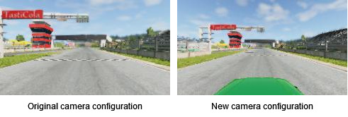
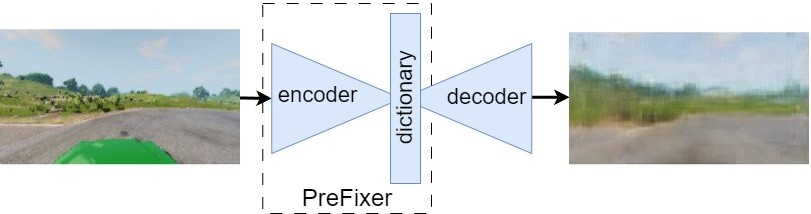

# Automated Generation of Transformations to Mitigate Sensor Hardware Migration in ADS
Learning transformations between vision datasets to overcome sensor hardware versioning

paper: [IEEE Robotics and Automation Letters (RA-L)](https://ieeexplore.ieee.org/document/10539233)
video: [YouTube](https://www.youtube.com/watch?v=t7dW_dZso8s)

## Overview
The main idea of this project is to come up with a universal transformation between dataset distributions.
The difference between these dataset distributions are a result of hardware versioning between sensors.
This transformation should preserve several properties of the original dataset:
1. The prediction of the base model.
2. The structure and features present in the image.




Problem setup



Input and output of trained PreFixer

## Training

```python
pip install -r requirements.txt
cd training
python train_lenscoder.py <path-to-dataset>
```
